# "Hackathon" de final de _Common Core_, películas

## Índice

- [Preámbulo](#preámbulo)
- [Resumen del proyecto](#resumen-del-proyecto)
- [Consideraciones generales](#consideraciones-generales)
- [Objetivos de aprendizaje](#objetivos-de-aprendizaje)
- [Parte obligatoria](#parte-obligatoria)
- [Consideraciones técnicas](#consideraciones-técnicas)
- [UX](#UX)

---

## Preámbulo

Con la aparición de plataformas para ver películas en la nube, como Netflix o
Amazon Prime Video, ver películas desde donde estés, comiendo lo que quieras
(sin tener que pagar precios ridículos por palomitas), parando si es necesario, teniendo acceso a una cantidad
abrumadora de películas... ha cambiado la experiencia del usuario
y modificado el mercado de las películas a nivel global.

## Resumen del proyecto

Durante estos días crearás el producto que quieras alrededor del mundo
de las películas. Puede ser un sitio que hable de las mejores películas
latinoamericanas, uno que recomiende las películas recién estrenadas en algún servicio de streaming, uno de recomendaciones de películas de terror,
comedia ... o... ¡lo que quieran!

## Consideraciones generales

- Este proyecto se debe resolver en equipos de hasta 4 personas.
- Usa la API de [OMDB](http://www.omdbapi.com/) (The Open Movie Database).
- Tiempo para completar el reto: 3 días.
- Habrán dos presentaciones, una a la mitad de la _hackathon_ y otra al final.

## Objetivos de aprendizaje

- Enfrentarte a un reto de corta duración en el que pongas
  en práctica todo lo aprendido hasta ahora.
- Que sigas desarrollando tus habilidades de trabajo en equipo. Mientras más
  personas en un equipo de trabajo, mayor complejidad para: tener un
  entendimiento común, seguir el flujo de trabajo, buscar consensos, etc.

## Parte Obligatoria

- Todo el planeamiento del trabajo deberá ser detallado en un repositorio único
  por _squad_ en el que se presente el _planning_, el _research_, los _sketches_
  y las inspiraciones utilizadas para definir el producto.
- Además, deberás detallar en el archivo _readme_, qué hizo cada una en el
  proyecto.
- El producto deberá presentarse publicado en github pages.

## Consideraciones técnicas

- El diseño visual de los componentes es de libre elección.
- Pueden usar algún framework de css si así lo deciden.

## Sobre las presentaciones

- Cada squad tendrá 5 minutos para presentar y 5 minutos para recibir preguntas.

- Las personas que presentan en la primera presentación no deben ser las mismas de la presentación final.

## UX

- INVESTIGACIÓN:

Preámbulo.

Dentro del ajetreado estilo de vida que llevamos el día de hoy, es impensable perder valiosos minutos buscando la película que deseas ver como medio de distracción. Es por ello que hemos creado "Top Movies". Una aplicación que te ayuda a elegir de una manera más rápida y sencilla la película de tu interés.

- Encuestas.

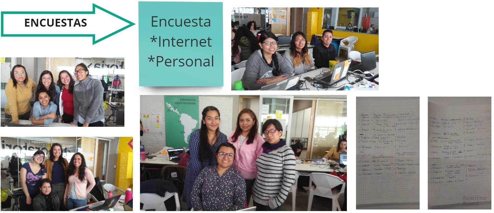

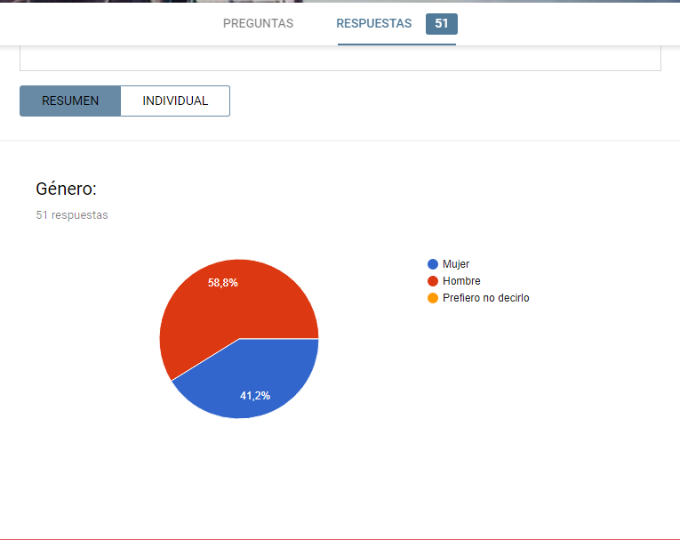

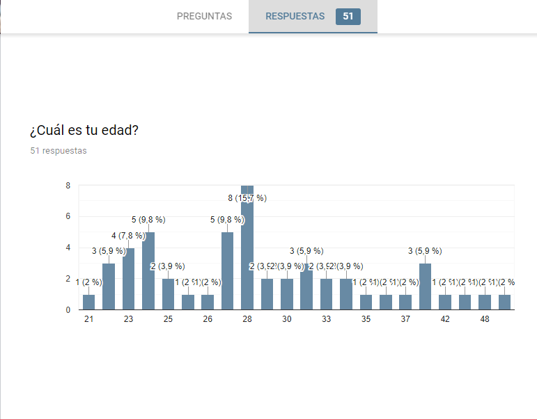

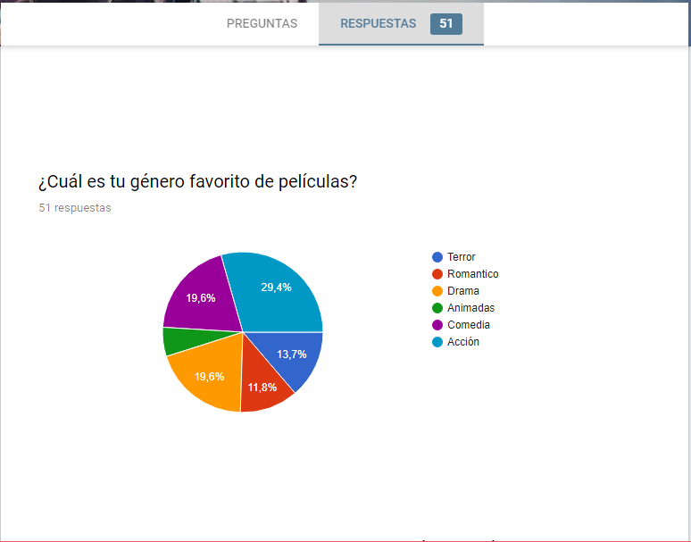

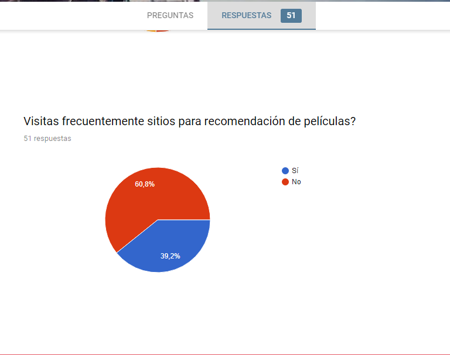

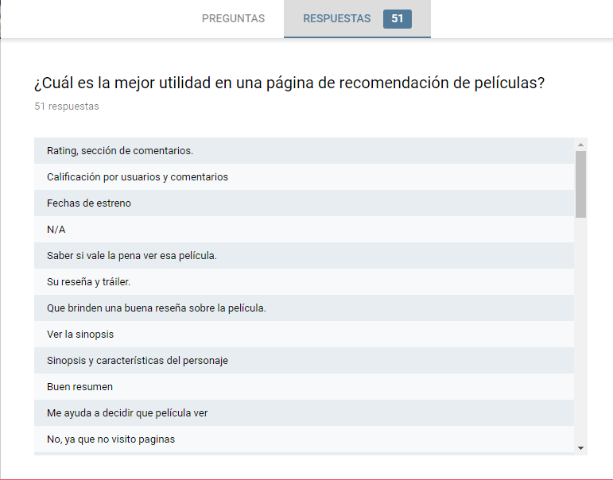

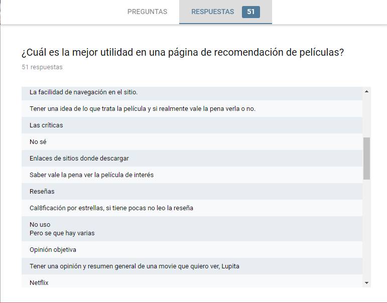

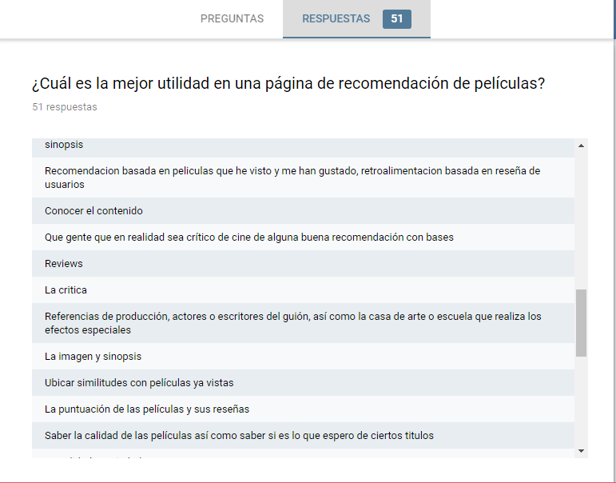

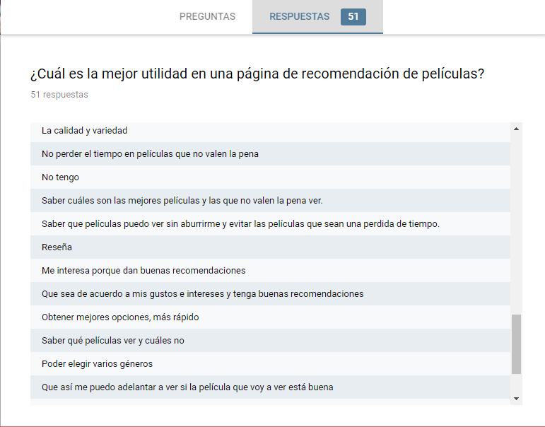

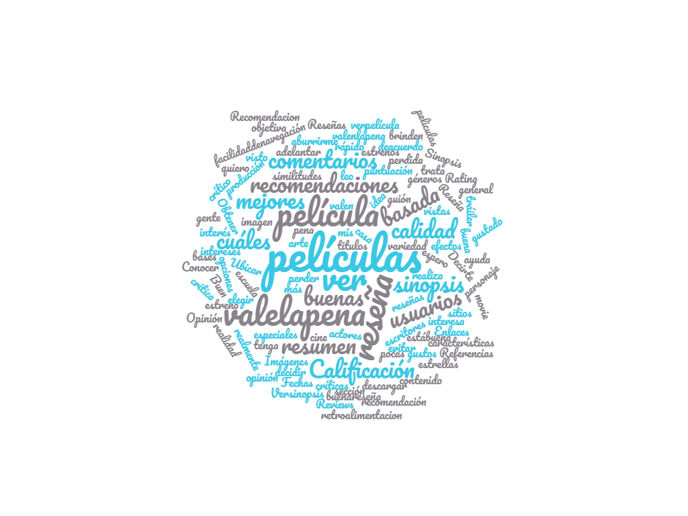

- Historias de Usario.

- Escenario 1 - Visualización de Estrenos. En caso que el usuario busque visualizar los estrenos de película y adicionalmente busque una sinopsis de la misma, cuando otras aplicaciones no le dejen obtenerla de manera adecuada, nuestra aplicación debe facilitarle la obtención de lo que nuestro usuario esta buscando.

- 
- Escenario 2. - Menú Accesible. En caso que el usuario busque de manera específica un género en particular y adicionalmente este sea de fácil acceso, cuando otras aplicaciones sean confusas y tediosas, el sistema debe dar un acceso intuitivo y fácil.

- 
- Escenario 3. - Elección de Película. En caso que el usuario elija una película y adicionalmente quiera saber si es buena o no, cuando otros sitios solo muestren la fecha de estreno, el sistema debe mostrarle al usuario una reseña completa de la película deseada.

- 
- Escenario 4.- Acceso Exclusivo. En caso que el usuario busqué un valor agregado dentro de la aplicación y adicionalmente cuente con los servicios básicos, cuando otras aplicaciones no otorguen esta facilidad, el sistema debe proporcionarle una forma de acceso exclusivo.

- Perfil de Usuario.

---

- PROCESO DE DISEÑO

- Prototipado de Baja fidelidad:

- Prototipado de Alta fidelidad:

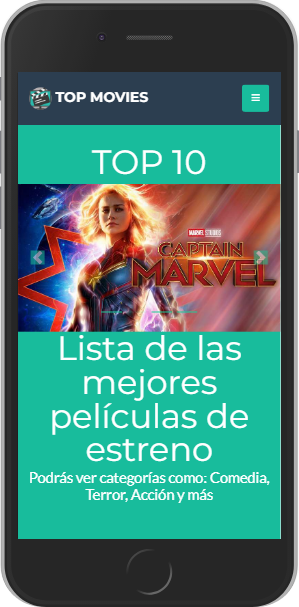
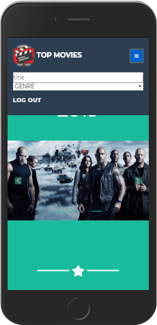
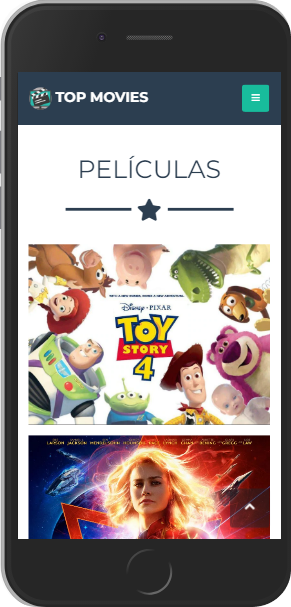
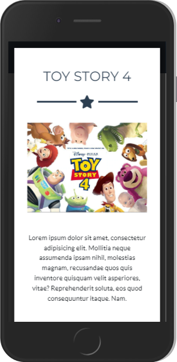

--- 
- BENCHMARKING COMPETITIVO.

El objetivo de esta investigación es comparar tres aplicaciones que tengan la misma funcionalidad que el nuestro, que es darle a nuestros usuarios recomendaciones de películas y que puedan elegir la que les agrade con respecto a su género con un diferenciador de otros que te agrega 30 películas más de estreno si es que ingresas con tu correo, nos muestra las películas que aún no se estrenan en México así el usuario podrá tener una idea de si conviene verla o no. La comparación nos dará un soporte de viabilidad de nuestra aplicación web.
Las aplicaciones que decidimos investigar fueron:

- Taste Dive: Este sitio es fácil de usar, lo único que debes hacer es escribir el nombre de una película que te gustó para que aparezcan resultados similares que podrían ser de tu agrado. Pero lo mejor de Taste Kid es que no sólo te recomendará películas, también te mostrará libros, cómics, música, series de televisión y videojuegos. Este motor de búsqueda te ayudará a cubrir todas tus necesidades de entretenimiento, según tus gustos.
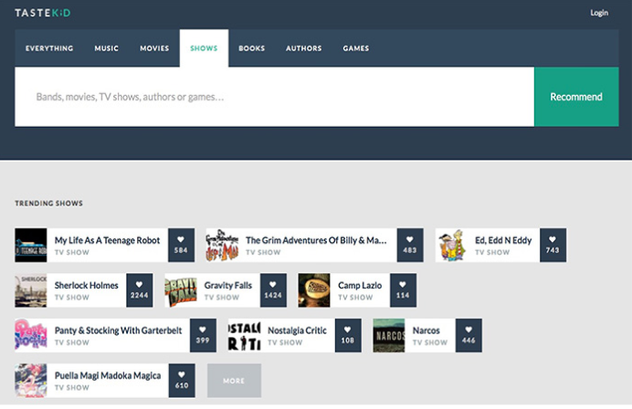

- A Good Movie To Watch. Este lugar es para todos aquellos que estén buscando ver una película que realmente tenga calidad, pero que probablemente no ha sido el típico éxito de Hollywood. Esta web recoge las películas que mejor calificación ha obtenido en IMDb y Rotten Tomatoes para posteriormente reducir la lista a aquellas que son altamente recomendadas a pesar de no haber tenido éxito en taquilla.
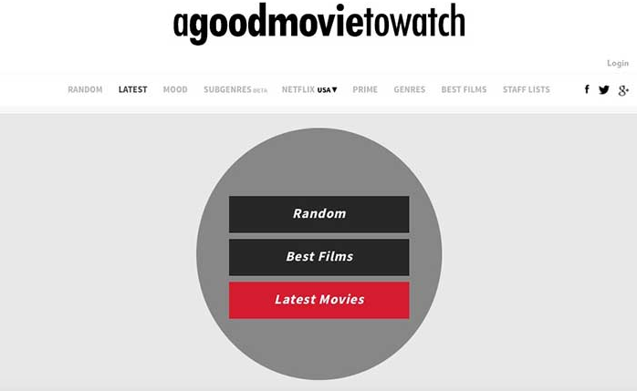

- Movieo. En esta web vamos a poder encontrar diferentes sugerencias de películas de una manera bastante sencilla y con funcionalidades básicas. Si entramos en las páginas, vamos a ver que dispone de una barra lateral en la que podemos aplicar diferentes filtros en función de los países, la fecha en que se estrenó la película y el género. Cada una de las películas dispone de una carátula en la que podemos hacer clic para acceder de forma detallada a la ficha de la película. En el buscador podemos introducir el nombre de algún director o actor que nos interese, para que se realice una búsqueda en base a esto.
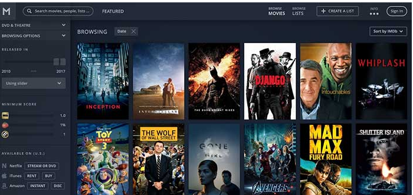

Notamos que ninguna de las aplicaciones web de recomendaciones tenía estrenos de películas si había categorización de género de películas, sin embargo hacía falta referencias de estrenos para que los usuarios puedan elegir entre una u otra. En nuestra aplicación tiene los mejores estrenos para resolver el conflicto que tenemos en nuestra primera historia de usuario y genera expectativa con el reparto y reseña de estas.

También notamos que los colores eran sombríos y tenían ciertas combinaciones pero muy sencillas para que contraste con todo el repertorio de las películas, eso hizo que en nuestras pruebas de usabilidad preguntáramos si eran atractivos nuestros colores, y la respuesta fue sencilla, si buscaban los usuarios una página no tan recargada y que fuera sencilla y funcional.

Una cosa que pudimos notar entre las apps es que la que se considera una de las mejores es debido a la interacción que provoca al loguearse el usuario y poder calificar una película y así saber cuál película es mejor o no. No obstante en nuestro proyecto decidimos hacer uso de las calificación de críticos experimentados y como son películas que quizá no se han estrenado aún puede que haya naja interacción entre nuestros usuarios. Sabemos que nuestra página tiene deficiencias y queremos hacer uso de este benchmarking para resolver algunas de las demandas de usuarios más frecuentes y adaptarlo a nuestra página.

--- 
- DELEGACIÓN DE TAREAS DENTRO DEL PROYECTO.
- Todas las integrantes del SQUAD contribuimos a la realización de las Historias de Usuario, a la creación del HTML así como al idealización del proyecto en cuanto a Diseño y funcionalidad; a través de GIT Hub Cooperativo.

- En la parte Frontend: Olga y Giovanna hicieron peer programing
- En la parte UX: Ariadna y Fabiola realizarón encuestas y readme.
